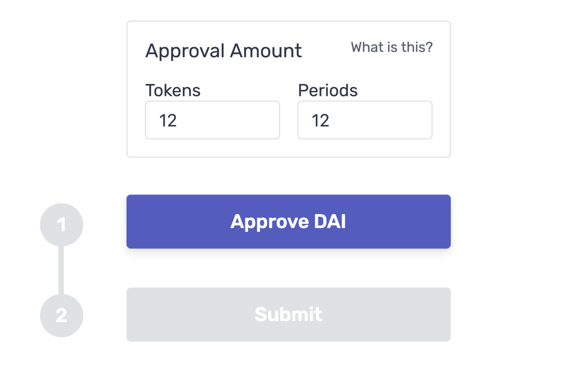

# Integrating with Daisy

<div style="max-width: 575px">

## Daisy enables anyone to accept cryptocurrency for purchases, subscriptions, usage fees and other payments. How you want to integrate Daisy into your app is up to you.
</div>

---
<div class="blurb-container">
<div class="blurb">

## Invitations

The quickest way to get started, Invitations are an almost-no-code solution, providing you a customizable UI built and hosted by Daisy.

[Get started with Invitations](https://docs.daisypayments.com/tutorial-Invitations.html)
</div>
<div class="blurb-content">
<div class="img-container" style="width: 300px; margin: 0 1em">
  
</div>
</div>
</div>

---
<div class="blurb-container">
<div class="blurb">

## Daisy Widget

Building a React application? Daisy Widget is a library of React components that can be incorporated within your project's existing frontend.

[Get started with Daisy Widget](https://docs.daisypayments.com/tutorial-Daisy-Widget.html)
</div>
<div class="blurb-content">
<div class="img-container" style="width: 380px">
  
</div>
</div>
</div>

---
<div class="blurb-container">
<div class="blurb">

## Daisy SDK

Daisy SDK is the entry point for interacting with payments and subscriptions programmatically. It can be used in both a browser and Node environment.

[Get started with Daisy SDK](https://docs.daisypayments.com/tutorial-Daisy-SDK.html)
</div>
<div class="blurb-content">
<div style="width: 500px; margin-left: 1em">

```js
import DaisySDK from "@daisypayments/daisy-sdk";
import Web3 from "web3";

const web3 = new Web3(...);
const daisy = new DaisySDK({ identifier: ... }, web3)
```
</div>
</div>
</div>

---
<div style="width: 80%">

### Still have questions?
While we have tried to make accepting cryptocurrency payments as simple as possible, we obviously understand if you still have outstanding questions. Feel free to reach out to us at [hello@daisypayments.com](mailto:hello@daisypayments.com).

</div>

---